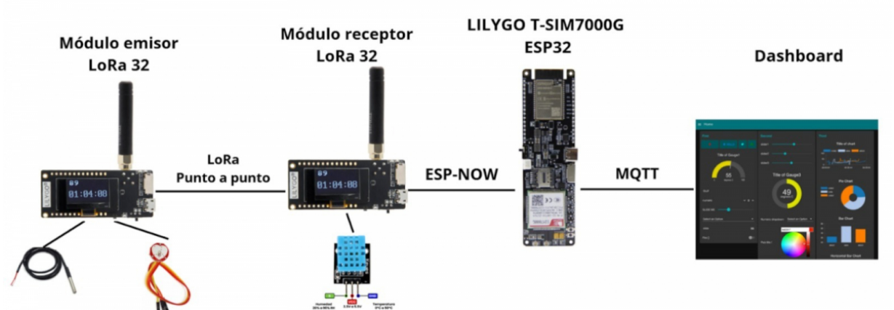

# Esquemáticos y Diagramas de Conexión

## Diagrama de Conexión del Collar Inteligente

### Componentes
- **Heltec LoRa 32**
- **LILYGO T-SIM7000G ESP32**
- **Sensor DS18B20**
- **Sensor OKY3471**
- **Sensor DHT11**
- **Batería 18650**

### Conexiones

1. **Heltec LoRa 32**
   - **VCC**: Conectar a la alimentación positiva de la batería (3.7V - 4.2V).
   - **GND**: Conectar a la tierra común.
   - **Pin de Dato (GPIO)**: Conectar a los sensores según se indica a continuación.

2. **Sensor DS18B20**
   - **VCC**: Conectar a 3.3V en la Heltec LoRa 32.
   - **GND**: Conectar a la tierra común.
   - **DATA**: Conectar a un pin GPIO (por ejemplo, GPIO 4) en la Heltec LoRa 32.

3. **Sensor OKY3471**
   - **VCC**: Conectar a 3.3V en la Heltec LoRa 32.
   - **GND**: Conectar a la tierra común.
   - **DATA**: Conectar a un pin GPIO (por ejemplo, GPIO 5) en la Heltec LoRa 32.

4. **Sensor DHT11**
   - **VCC**: Conectar a 3.3V en la Heltec LoRa 32.
   - **GND**: Conectar a la tierra común.
   - **DATA**: Conectar a un pin GPIO (por ejemplo, GPIO 6) en la Heltec LoRa 32.

5. **LILYGO T-SIM7000G ESP32**
   - **VCC**: Conectar a la alimentación positiva de la batería (3.7V - 4.2V).
   - **GND**: Conectar a la tierra común.
   - **TX**: Conectar al RX del Heltec LoRa 32.
   - **RX**: Conectar al TX del Heltec LoRa 32.

## Diagrama Visual

# Configuración

## Instrucciones para la Configuración Física de los Componentes de Hardware

### Componentes Necesarios
- Heltec LoRa 32
- LILYGO T-SIM7000G ESP32
- Sensor DS18B20
- Sensor OKY3471
- Sensor DHT11
- Batería 18650
- Cables de conexión

### Pasos de Configuración

1. **Montaje del Collar**
   - Coloca todos los componentes en la carcasa del collar de manera segura.
   - Asegúrate de que la batería esté fácilmente accesible para la carga.

2. **Conexiones de los Sensores**
   - Conecta cada sensor a los pines GPIO especificados en el diagrama de conexión:
     - **DS18B20**: GPIO 4
     - **OKY3471**: GPIO 5
     - **DHT11**: GPIO 6
   - Conecta los pines de alimentación (VCC y GND) a la fuente de alimentación de la Heltec LoRa 32.

3. **Conexiones de la Placa LoRa 32**
   - Conecta la LILYGO T-SIM7000G ESP32 a la Heltec LoRa 32:
     - **TX** de Heltec a **RX** de LILYGO.
     - **RX** de Heltec a **TX** de LILYGO.
   - Asegúrate de que ambas placas estén alimentadas correctamente.

4. **Verificación**
   - Antes de encender, revisa todas las conexiones y asegúrate de que no haya cortocircuitos.
   - Enciende el sistema y verifica que los sensores estén funcionando correctamente.

